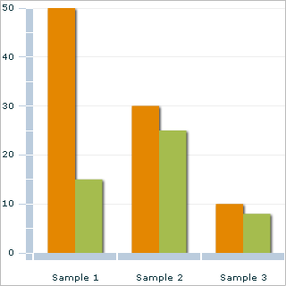

# Introduction

Some text here. Recently, @lyngs2019 has published an awesome paper. 

The results of the study are quite promising for future researchers [@lyngs2019].

\begin{center}
\captionof{figure}{A barchart from wikimedia commons hahd basf basdg asa sda sdsfa}\label{fig:barchart2}
```{r echo=FALSE, out.width='70%', fig.align='center'}

```
\end{center}


`r lorem::ipsum(paragraphs = 3)`


\begin{center}
\captionof{figure}{A barchart from wikimedia commons hahd basf basdg asa sda sdsfa}\label{fig:barchart}
```{r echo=FALSE, out.width='70%', fig.align='center'}

```
\end{center}

From Figure \@ref(fig:barchart), one can observe that Sample 1 has the highest frequency count.

`r lorem::ipsum(paragraphs = 3)`

# Background of the Study

Some text here. Recently, @AMEZ2020101618 has published an awesome paper. 

The results of the study are quite promising for future researchers [p.13, @AMEZ2020101618; p.24-27, @lyngs2019].


`r lorem::ipsum(paragraphs = 4)`

```{r echo=FALSE}
suppressWarnings(suppressMessages(library(tidyverse)))
```

\begin{center}
\captionof{table}{A glimpse of mtcars data set}\label{tab:mtcars1}
```{r echo=FALSE}
mtcars[1:5, 1:3] %>% 
  colMeans %>% 
  rbind %>% 
  `row.names<-`("Average") %>% 
  knitr::kable(format = 'latex', booktabs = TRUE)
```
\end{center}


\begin{center}
\captionof{table}{A glimpse of mtcars data set}\label{tab:mtcars2}
```{r echo=FALSE}
mtcars[1:10, 1:3] %>% 
  knitr::kable(format = 'latex', booktabs = TRUE)
```
\end{center}

blasfj;slkfj s;lkdjf; akljsdg

From Figure \@ref(fig:barchart), one can observe that Sample 1 has the highest frequency count.

One can see from Table \@ref(tab:mtcars1), lsjfd;lasj .


# References

